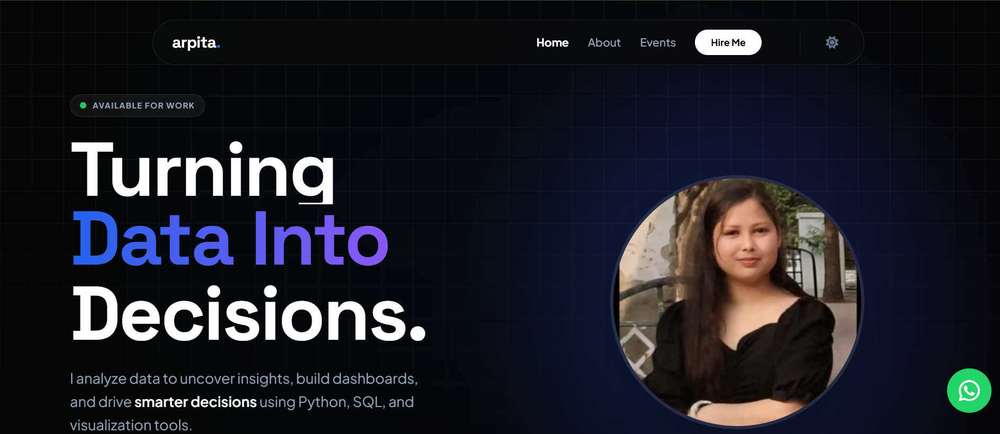

# Amine – Creative Developer Portfolio 🚀

A modern, high-performance personal portfolio website showcasing my work as a **Frontend Developer & UI/UX Designer**.  
Built with a strong focus on **animations, performance, and user experience**.

---

## Live Demo 🚀

You can view the live website here: [Live Demo](https://arpiii-dev.netlify.app/)

---

## ✨ Features

- 🌙 **Dark / Light Mode** (saved in LocalStorage)
- ⚡ **Preloader Animation**
- 🎯 **ScrollSpy Navigation**
- 🧲 **Magnetic Button Effect**
- 💡 **Spotlight Hover Cards**
- 🌀 **3D Tilt Project Cards**
- 🖼️ **Parallax Images**
- 📂 **Project Filtering System**
- 🪟 **Project Modal Preview**
- 🔔 **Toast Notifications**
- 👁️ **Intersection Observer Scroll Reveal**
- 📱 Fully **Responsive Design**

---

## 🛠️ Tech Stack

- **HTML5**
- **CSS3** (Custom + Advanced Animations)
- **Tailwind CSS (CDN)**
- **JavaScript (Vanilla)**
- **Font Awesome**
- **Google Fonts**

---

## 📂 Project Structure

```bash
📦 Portfolio9
 ┣ 📜 index.html          # Main HTML file
 ┣ 📜 style.css           # Website styling
 ┣ 📜 script.js           # Main JavaScript file
 ┣ 📂 images              # Images and logos
 ┗ 📜 README.md           # Project documentation
```
---

made with 💖 sarthak 
